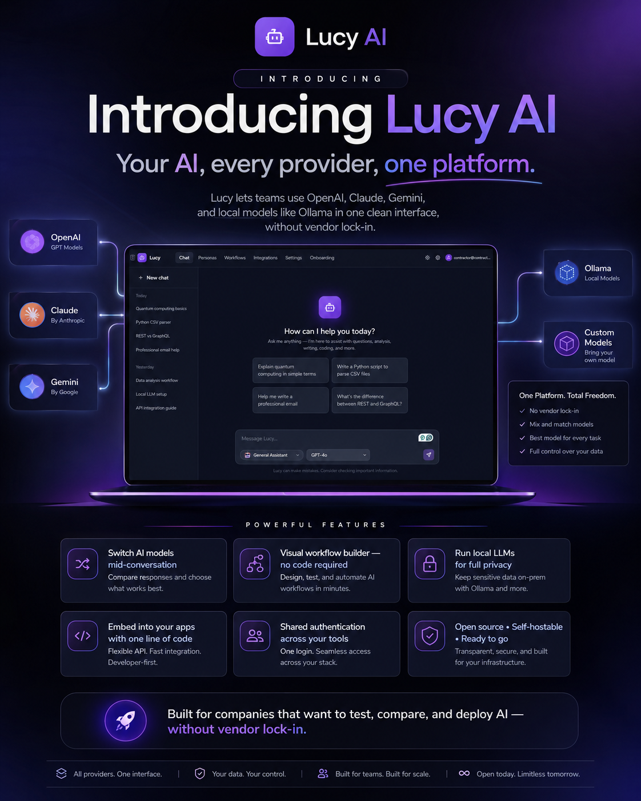

# Lucy AI

<p align="center">
  
</p>

<p align="center">
  <strong>Your AI. Every provider. One memory.</strong>
</p>

<p align="center">
  
  
  
  
  
  
  
</p>

Lucy runs OpenAI, Claude, Gemini, and local models like Ollama in one interface that remembers your work, connects to your tools, and keeps your keys on your machine.

**Lucy is a closed environment, with a brain.** Most AI platforms are someone else's cloud — Lucy is a sealed room inside your company. She remembers your decisions and context (the brain), keeps every byte on your deployment under your keys (the walls), and embeds into any app you own with one line of code (the doors). Your company, your data, and nobody else's business.

> **Switch AI models mid-conversation** | **Memory that compounds** | **MCP connector marketplace** | **Visual workflow builder** | **Run local LLMs for full privacy** | **Voice in, voice out** | **Embed with one line of code** | **Open source. Self-hostable. Free.**

Built for teams that want to test, compare, and ship AI — self-hosted, on infrastructure you control.

📚 **Documentation:** in-app at [`/docs`](http://localhost:3001/docs) when Lucy is running, or browse the markdown in [`docs/kb/`](docs/kb/) — guides for users (chat, memory, personas, connectors, workflows, voice, themes) and developers (architecture, self-hosting, embedding, HTTP API, MCP server, contributing).

---

## Overview

Lucy is a self-hosted AI platform for teams that want to roll out AI tooling without handing their data to someone else's cloud. It connects to OpenAI, Anthropic Claude, Google Gemini, and **local models via Ollama and LM Studio** through a unified provider interface, streams responses in real time, and lets you switch models mid-conversation. All chat history and settings are stored either locally in the browser (zero-infrastructure standalone mode) or persisted to a Supabase PostgreSQL database when you need multi-user, cross-device access.

Beyond chat, Lucy ships a **visual workflow builder** — a drag-and-drop canvas powered by React Flow — where you can compose multi-step AI pipelines from a rich node library (AI Agent, Knowledge Base, Condition, Filter, Transform, Code, HTTP, Send Email, Integration, …). In connected mode workflows run **server-side and durably** (a run survives closing the tab, with saved history and per-node logs), fire automatically on **triggers** (schedule, webhook, or record-change events), **retry** failed runs with backoff, support run **cancellation**, and keep **published versions** you can restore. On the desktop app they run locally in the browser.

The **integration layer** lets other applications register themselves with Lucy's project registry. Once registered, Lucy can read live data from the app's Supabase tables, inject it into the AI system prompt as context, and trigger actions on the app's behalf. An embeddable widget ships via a single `<script>` tag for easy integration into any web page.

---

## Screenshots

> Replace the placeholders below with actual screenshots once the application is running.

| Screen | Description |
|---|---|
| `docs/screenshots/chat.png` | Main chat interface — conversation sidebar, model selector, streaming message output |
| `docs/screenshots/workflow-builder.png` | Visual workflow canvas with node panel, configuration sidebar, and run panel |
| `docs/screenshots/personas.png` | Personas management page — built-in and custom AI personas |
| `docs/screenshots/onboarding.png` | 4-step company onboarding wizard |
| `docs/screenshots/settings.png` | Settings page — API key management, local models detection, theme toggle |
| `docs/screenshots/integrations.png` | Integrations page listing registered connected projects |
| `docs/screenshots/embed-widget.png` | Embeddable chat widget mounted in an external application |

---

## Features

### Multi-Provider AI Chat
- Connect to **OpenAI** (GPT-4o, GPT-4o Mini, GPT-3.5 Turbo), **Anthropic** (Claude Sonnet 4, Claude Haiku 4), **Google** (Gemini 2.0 Flash, Gemini 1.5 Pro), **DeepSeek** (V3 Chat, R1 Reasoner), **Groq** (Llama 3.3 70B, Llama 3.1 8B, Gemma 2), **Mistral** (Large, Small), **xAI** (Grok 2, Grok Beta), **OpenRouter** (gateway), and **local models** (via Ollama or LM Studio) from a single interface
- **Real-time streaming** responses via Server-Sent Events — tokens render as they arrive
- **Per-conversation model switching** — change provider and model without starting a new session
- Conversation history with auto-generated titles, searchable sidebar
- **Message editing** — edit any user message inline; saving re-sends the conversation from that point
- **Response regeneration** — regenerate any assistant reply with a single click
- **Conversation export** — download any chat as Markdown or JSON from the chat header menu
- **Rate limiting** — chat API enforces 30 requests per minute per IP to protect server-level API keys

### Memory (connected mode)
- **Lucy remembers across conversations** — facts, preferences, working style, and what happened when (semantic / pragmatic / episodic)
- **Always-on profile + searchable collection** — a compact identity block is always present; relevant memories are retrieved per message via **hybrid search** (pgvector + full-text, fused with Reciprocal Rank Fusion)
- **Entity salience** — recurring terms (clients, products, jargon) auto-promote in importance the more they appear
- **Reconciliation-aware capture** — one end-of-conversation pass extracts, de-duplicates, and reconciles (ADD / UPDATE / MERGE / SKIP); a privacy guard never stores secrets or PII
- **`/remember`** pins a fact instantly; **`/global`** contributes it to shared knowledge; **incognito** skips capture for a session
- **Admin-gated** with storage-usage visibility, configurable contradiction policy (supersede / keep-history), and a staged archive → grace-window → delete flow
- **Dual-mode by design** — full semantic memory in connected (Supabase) mode; a lexical fallback engine for standalone mode
- **Pluggable embedder** — pick OpenAI `text-embedding-3-small` or a fully-local **Ollama** model (e.g. `embeddinggemma`) in Settings → Memory; the pgvector column reshapes to match the chosen dimension automatically

### Terminal CLI
- **`lucy chat`** — streaming chat in any shell, with the same memory and encrypted provider keys as the web app
- **Rich REPL** — welcome banner, Markdown-rendered replies (code blocks, lists, bold), a thinking spinner, `/`-command Tab autocomplete, and boxed output; defaults to a model whose provider you actually have a key for
- **Pipe-friendly one-shots** — `cat error.log | lucy chat "explain this"` (plain text when piped)
- **`lucy models / memories / screenings / admin / whoami`** — manage your deployment without leaving the terminal
- Thin client over Lucy's HTTP API, authenticated with a Lucy API key; configure once with `lucy login` (`~/.lucy/config.json`, or `LUCY_URL`/`LUCY_API_KEY` env vars)
- Run via `npm run lucy -- <cmd>` in the repo, or `npm link` for a global `lucy` command

### MCP Connector Marketplace
- **Browse, install, configure** — a curated catalog of MCP connectors (GitHub, Slack, Notion, Postgres, Linear, Stripe, Brave Search, Filesystem, Fetch) installable per user with one click
- **Tool use in chat** — Lucy calls connector tools mid-conversation (OpenAI-compatible + Anthropic providers); tool calls render as live status chips above the streaming reply
- **Encrypted secrets** — connector credentials are AES-256-GCM encrypted at rest and never returned to the browser
- **Approval gating** — flag any installation so write-like actions (create/update/delete/send) require your approval instead of executing silently

### Voice (STT + TTS)
- **Mic input** — browser Web Speech (live interim text) or cloud Whisper/Deepgram press-to-record
- **Read-aloud** — per-message speaker button plus auto-read; browser voices, OpenAI TTS, or any OpenAI-compatible local server
- Configured in **Settings → Voice**; keys travel via request headers only

### Desktop App (local-first)
- Ships as a downloadable **Electron** app for **Windows (`.exe`)**, **macOS (`.dmg`)**, and **Linux (`.AppImage`)** — runs the full Lucy server locally
- **Local-first** — no account required; chats, memory, and provider keys stay on your machine in standalone mode
- **First-run wizard** — pick a cloud API key or a local Ollama / LM Studio model and start
- **Connect to Cloud** — optionally push local chats and settings to a justlucy.ai account (one-way, idempotent sync)
- OS-detecting download page at **`/download`**

### Channels — Telegram
- Run Lucy as a **Telegram bot** from **Admin → Channels** — paste a BotFather token, register the webhook, and chat with the same memory and encrypted keys
- **Shared** mode (one bot on your keys, optional Telegram user-ID allowlist) or **Linked** mode (each user binds their own account with a `/link` code)

### Five Themes
- **Luminous** (default — glassy purple glow), **Industrial** (sharp, structured), **Editorial** (bold typography, stark contrast), **Minimal dark**, and **Light**
- CSS-variable design tokens restyle the entire app instantly; picker in Settings → General; set in **Manrope** via `next/font`

### Chat Commands
Type **`/`** in the chat box for an autocomplete menu of slash-commands:

| Command | Effect |
|---|---|
| `/remember <text>` | Save a fact to memory |
| `/forget <text>` | Forget memories matching the text |
| `/global <text>` | Save shared knowledge for everyone |
| `/memories` | Show what Lucy remembers (count + recent) |
| `/incognito` | Toggle: don't capture memories this session |
| `/new` | Start a new conversation |
| `/help` | List all commands |

Arrow keys + **Enter/Tab** to apply, **Esc** to dismiss. Arg-commands prime the input; no-arg commands fire immediately. The registry lives in `lib/chat/slash-commands.ts`.

### AI Personas
- **5 built-in personas** with purpose-built system prompts:
  - **General Assistant** — helpful and balanced for everyday tasks
  - **Code Expert** — senior developer persona for TypeScript, React, and Node.js
  - **Creative Writer** — storytelling, copywriting, and creative content
  - **Data Analyst** — SQL, pandas, statistics, and data visualisation
  - **Onboarding Guide** — patient guide for helping new employees
- **Create custom personas** — define your own name, icon, description, and system prompt on the `/personas` page
- **Persona selector chip** in the chat input — pick a persona without leaving the conversation
- Built-in personas cannot be deleted; custom ones can be edited or removed
- Active persona system prompt is injected at the start of each new conversation
- Personas are persisted to `localStorage` under the `lucy-personas` key

### Token Tracking
- **Per-message token estimates** — shown on hover for each message (heuristic: ~4 chars/token)
- **Conversation total** displayed in the chat header as `~N tokens this conversation`
- Implemented in `lib/utils/tokens.ts` via `estimateTokens()` and `estimateConversationTokens()`

### Local LLM Support
- Run AI models **entirely on your own machine** via [Ollama](https://ollama.com) or [LM Studio](https://lmstudio.ai)
- Both expose an OpenAI-compatible API — Lucy connects without any API key
- **Auto-detection** — the model selector probes localhost at startup and lists available models automatically
- **Detect Models** button in Settings discovers what is currently loaded
- Configurable server URLs (defaults: `http://localhost:11434` for Ollama, `http://localhost:1234` for LM Studio)
- Gracefully skipped when local servers are not running — cloud providers continue to work

### Authentication
- **Login, signup, and forgot-password** pages built with Supabase Auth
- **Google OAuth** — one-click sign-in via Google
- **Auth middleware** — protects `/chat`, `/workflows`, and `/settings` routes when Supabase is configured; redirects unauthenticated users to `/auth/login` with a `redirectTo` param
- In **standalone mode** (no Supabase configured), auth is fully bypassed and all routes are public
- **User avatar and sign-out** in the header when signed in
- **Two-factor authentication** — email-OTP and TOTP authenticator-app 2FA, with a login challenge gate
- **Account security** — password reset via emailed code, active-device tracking, and a profile / account page
- **Transactional email** — reset and 2FA codes sent over SMTP (configure the `SMTP_*` env vars)
- `/personas` route is always public (not protected by auth middleware)

### Progressive Web App (PWA)
- Full **Web App Manifest** with name, short name, display mode, theme colour, and icons
- Favicon and app icons render the **Lucy brand mark** — `app/icon.svg` (favicon), 192×192 and 512×512 PWA icons, and an Apple touch icon
- Can be installed as a standalone app on desktop and mobile

### Visual Workflow Builder
- Drag-and-drop canvas built on **React Flow (@xyflow/react)**
- **Rich node library** — AI Agent (pick provider + model), Knowledge Base, Condition, Filter, Transform, Code (JS), HTTP, Send Email, Integration, Output
- **Durable server-side execution** (connected mode) via an in-process worker + a Postgres run queue — runs survive closing the tab, with saved history, per-node logs, and **cancellation**; the desktop app runs workflows in-browser
- **Triggers** — run automatically **on a schedule** (cron), from a **webhook** (secret URL), or on **record events** (row created/updated/deleted)
- **Retry/backoff + idempotency** for trigger-fired runs; **DRAFT/PUBLISHED versions** with restore
- Execution log panel with per-node input/output inspection

### Code Blocks
- Syntax-highlighted code blocks rendered via **rehype-highlight**
- Language label shown in the block header
- **Copy button** on every code block
- **Line numbers** shown automatically when a block has more than 5 lines
- Horizontally scrollable to handle wide code without breaking layout

### Accessibility (ARIA)
- Semantic HTML throughout: `<header role="banner">`, `<nav role="navigation">`, `<main>`, `<form role="form">`, message list as `<div role="log" aria-live="polite">`
- All interactive elements have `aria-label` attributes
- Persona selector uses `role="listbox"` / `role="option"` / `aria-selected`
- Conversation list items have `aria-current` for the active conversation
- Export button has `aria-expanded` and `aria-haspopup`
- Header user menu has `aria-expanded` and `aria-haspopup`
- Mobile hamburger button has `aria-expanded` and `aria-label`

### Mobile Responsive
- **Hamburger menu** in the header on small screens — tap to open a full-width dropdown nav
- **Sidebar overlay** — on mobile, the conversation sidebar slides in as a fixed overlay with a backdrop
- **Swipe-to-close** — swipe left on the mobile sidebar to dismiss it (60 px threshold)
- Sidebar close button visible in mobile overlay mode
- Selecting a conversation auto-closes the mobile sidebar
- Chat input bottom bar wraps gracefully on narrow screens

### Keyboard Shortcuts
- `Cmd/Ctrl+K` — focus the conversation search input
- `Cmd/Ctrl+Shift+N` — start a new chat
- `Escape` — close the sidebar on mobile
- `Enter` — send message (in chat input)
- `Shift+Enter` — insert newline in chat input
- `Cmd/Ctrl+Enter` — save an inline message edit
- `Escape` — cancel an inline message edit

### Dual Storage — Standalone and Connected Modes
- **Standalone mode** (default): zero configuration, all data in browser `localStorage` under the `lucy-` namespace. No backend required.
- **Connected mode**: point `NEXT_PUBLIC_SUPABASE_URL` and `NEXT_PUBLIC_SUPABASE_ANON_KEY` at a Supabase project and Lucy switches automatically to PostgreSQL-backed persistence with Supabase Auth
- The entire application is written against a `StorageAdapter` interface — swapping backends requires no component changes

### Theming and UX Polish
- **Light and dark themes** — toggle from the header or Settings page
- **No flash on load** — an inline `<script>` in the root layout reads the stored theme before React hydrates, so there is never a white flash on a dark-mode page
- **ThemeProvider** keeps the `<html>` class in sync with the Zustand store in real time
- **Loading skeletons** for the chat and workflows pages — shown while JavaScript bundles load
- **Global loading page** — animated bouncing dots with the Lucy logo
- **Error boundary** (`app/error.tsx`) catches React render errors and shows a friendly "Try again" screen
- **404 page** (`app/not-found.tsx`) with a link back to chat

### Project Integration Layer
- **Registry** — external apps call `registerProject()` to describe their tables, columns, and available actions
- **Context builder** — at chat time, Lucy queries the registered app's live Supabase data and injects a concise summary into the LLM system prompt (token-budget aware)
- **Action executor** — four handler types: `supabase-insert`, `supabase-update`, `api-call`, and `workflow`
- **Embeddable widget** — serve Lucy as an iframe chat panel in any web app via a single `<script>` tag

### Company Onboarding
- 4-step guided wizard: **Welcome** (company name) → **API Keys** → **Test Chat** → **Invite**
- API keys are stored locally or encrypted in Supabase; they never leave the user's own infrastructure

### AI Screening Engine
- **Profile Verification** — automatic one-shot review of a contractor's profile with AI-generated grade (1–5), strengths, and concerns
- **Project Screening** — client-initiated multi-step screening: Lucy generates 5–8 tailored questions, the contractor answers, then Lucy grades the fit
- **Grading scale**: Excellent Match (5) → Not Recommended (1)
- Results visible only to the screening creator (RLS-enforced)
- API endpoints: `POST /api/screening/start`, `GET/POST /api/screening/:id`, `GET /api/screening`

### API Key System
- External applications authenticate to Lucy using per-user API keys
- Key format: `lucy_k_<24-random-base64url-chars>` — only the SHA-256 hash is stored in the database
- Full key shown once on creation, never again
- Manage keys from the Settings page (Supabase mode only)
- API routes: `POST /api/keys` (create), `GET /api/keys` (list), `DELETE /api/keys` (revoke/delete)

### MCP Server
- Lucy exposes screening tools via the **Model Context Protocol** for use with Claude Code, Cursor, and other MCP-compatible editors
- 5 tools: `start_screening`, `get_screening`, `list_screenings`, `submit_screening_answers`, `verify_contractor_profile`
- Run with `npm run mcp` — uses stdio transport

---

## Quick Start

### Prerequisites
- Node.js 18 or later
- npm 9 or later
- At least one AI provider API key (OpenAI, Anthropic, or Google) — or a running Ollama instance for local-only use

### Steps

```bash
# 1. Clone the repository
git clone https://github.com/JustLucyHQ/lucy.git
cd LucyAI

# 2. Install dependencies
npm install

# 3. Create your local environment file
cp .env.example .env.local

# 4. Open .env.local and add your API keys (see Configuration below)

# 5. Start the development server
npm run dev

# 6. Open the application
# http://localhost:3001
```

On first launch you will be redirected to the onboarding wizard to set your company name and configure API keys.

---

## Docker

Lucy ships with a multi-stage `Dockerfile` and a `docker-compose.yml` for running the production build in a container.

### Using docker-compose (recommended)

```bash
# Build and start the container
# API keys are picked up from your shell environment or a .env file
OPENAI_API_KEY=sk-... docker-compose up --build

# Or export variables first, then run
export OPENAI_API_KEY=sk-...
export ANTHROPIC_API_KEY=sk-ant-...
docker-compose up --build
```

The app is available at `http://localhost:3000`.

### Building the Docker image manually

```bash
# Build
docker build -t lucy-ai .

# Run
docker run -p 3000:3000 \
  -e OPENAI_API_KEY=sk-... \
  -e ANTHROPIC_API_KEY=sk-ant-... \
  lucy-ai
```

### Dockerfile details

The build uses a three-stage approach:

1. **deps** — installs production dependencies only (`npm ci --omit=dev`)
2. **builder** — copies source and runs `next build` (telemetry disabled)
3. **runner** — minimal `node:20-alpine` image running `server.js` as a non-root user

The `docker-compose.yml` maps `OLLAMA_URL` and `LM_STUDIO_URL` to `host.docker.internal` so the containerised app can reach Ollama or LM Studio running on the host machine.

---

## Testing

Lucy has **282 tests across 49 test suites** written with Jest and React Testing Library. A representative sample:

### Running tests

```bash
# Run all tests once
npm test

# Run in watch mode (re-runs on file change)
npm run test:watch

# Type-check without running tests
npx tsc --noEmit
```

### Test suites

| Suite | File | What is covered |
|---|---|---|
| Provider registry | `__tests__/lib/providers/index.test.ts` | `getProvider`, `getProviderForModel`, `getAllModels`, `getModelsByProvider` |
| Local storage adapter | `__tests__/lib/storage/local.test.ts` | `LocalStorageAdapter` CRUD, conversation/message/preference/provider config |
| Workflow engine | `__tests__/lib/workflow/engine.test.ts` | Start→Output execution, edge following, condition branching, transform operations |
| Integration registry | `__tests__/lib/integrations/registry.test.ts` | `registerProject`, `getProject`, `getAllProjects`, `getProjectTables`, `getProjectActions` |
| Markdown utilities | `__tests__/lib/utils/markdown.test.ts` | `hasMarkdown`, `generateConversationTitle`, `truncate` |
| ModelSelector component | `__tests__/components/chat/ModelSelector.test.tsx` | Renders provider groups, `onChange` callback fires with correct model id |
| Button component | `__tests__/components/ui/Button.test.tsx` | Renders children, variant classes, loading spinner, disabled state, click behaviour |

### Test configuration

- **Framework**: Jest 29 with `ts-jest` for TypeScript transpilation
- **Environment**: `jsdom` (browser-like, suitable for React component tests)
- **Setup file**: `jest.setup.ts` loads `@testing-library/jest-dom` matchers
- **Module alias**: `@/` maps to the project root (matches `tsconfig.json` paths)
- **Test location**: all test files live under `__tests__/` mirroring the source tree

---

## Configuration

All configuration is done through environment variables. Copy `.env.example` to `.env.local` and fill in the values relevant to your setup.

| Variable | Required | Description |
|---|---|---|
| `OPENAI_API_KEY` | Optional* | OpenAI API key. Required to use GPT-4o, GPT-4o Mini, or GPT-3.5 Turbo. Format: `sk-...` |
| `ANTHROPIC_API_KEY` | Optional* | Anthropic API key. Required to use Claude Sonnet 4 or Claude Haiku 4. Format: `sk-ant-...` |
| `GOOGLE_API_KEY` | Optional* | Google AI API key. Required to use Gemini 2.0 Flash or Gemini 1.5 Pro. Format: `AIza...` |
| `DEEPSEEK_API_KEY` | Optional* | DeepSeek API key. Required to use DeepSeek V3 (Chat) or DeepSeek R1 (Reasoner). Format: `sk-...` |
| `GROQ_API_KEY` | Optional* | Groq API key (very fast inference). Format: `gsk_...` |
| `MISTRAL_API_KEY` | Optional* | Mistral API key (Mistral Large / Small). |
| `XAI_API_KEY` | Optional* | xAI API key for Grok models. Format: `xai-...` |
| `OPENROUTER_API_KEY` | Optional* | OpenRouter API key — one key, many models. Format: `sk-or-...` |
| `NEXT_PUBLIC_SITE_URL` | Optional | Canonical public URL of the deployment (e.g. `https://justlucy.ai`). Drives OG / canonical / manifest URLs; inlined at **build** time. |
| `SMTP_HOST` / `SMTP_PORT` / `SMTP_USER` / `SMTP_PASS` / `SMTP_FROM` | Optional | SMTP credentials for password-reset and 2FA emails (connected mode). |
| `NEXT_PUBLIC_SUPABASE_URL` | Optional | Your Supabase project URL (e.g. `https://xyz.supabase.co`). When omitted, Lucy runs in standalone localStorage mode. |
| `NEXT_PUBLIC_SUPABASE_ANON_KEY` | Optional | Your Supabase project's `anon` public key. Required when `NEXT_PUBLIC_SUPABASE_URL` is set. |
| `SUPABASE_SERVICE_ROLE_KEY` | Optional | Service-role key for screening + memory APIs (bypasses RLS). Required when using the screening or connected-memory endpoints. |
| `LUCY_ADMIN_EMAIL` | Optional | When set, only these signed-in users may change global memory settings (Settings → Memory). Accepts a single email or a comma-separated list. Unset means any authenticated user may toggle. |
| `LUCY_URL` | Optional | Lucy's own URL for MCP callbacks. Default: `http://localhost:3001`. |
| `LUCY_API_KEY` | Optional | API key for MCP server and external integrations (e.g., Contractors Room). |
| `OLLAMA_URL` | Optional | Base URL for the Ollama server. Default: `http://localhost:11434`. |
| `LM_STUDIO_URL` | Optional | Base URL for the LM Studio local server. Default: `http://localhost:1234`. |

> *At least one AI provider key is required to send messages to cloud models. Local models via Ollama or LM Studio require no API key. Keys can also be entered per-user through the Settings page; server-level keys act as a shared fallback.

---

## Auth

Authentication is built on **Supabase Auth** and is completely optional. When `NEXT_PUBLIC_SUPABASE_URL` and `NEXT_PUBLIC_SUPABASE_ANON_KEY` are set, auth is automatically enabled. When they are not set, Lucy runs in anonymous standalone mode and all routes are public.

### Auth routes

| Route | Description |
|---|---|
| `/auth/login` | Email + password sign-in and Google OAuth |
| `/auth/signup` | New account creation with email confirmation |
| `/auth/forgot-password` | Send a password-reset email |
| `/auth/callback` | Supabase OAuth redirect handler (server route) |

### Middleware

`middleware.ts` runs on every request. When auth is enabled it:
1. Lets all requests to `/auth/*`, `/api/*`, `/onboarding`, `/embed`, `/personas`, and static assets through unconditionally.
2. Checks the Supabase session cookie for requests to `/chat`, `/workflows`, and `/settings`.
3. Redirects unauthenticated requests to `/auth/login?redirectTo=<original-path>`.

If anything goes wrong during session verification the middleware fails open (allows the request) to avoid blocking the app.

### Google OAuth setup

In your Supabase project → Authentication → Providers → Google, enable Google and add your OAuth client ID and secret. Add `https://your-lucy-instance.com/auth/callback` to the authorised redirect URIs in your Google Cloud Console project.

---

## Personas

Personas configure the AI's personality and expertise by injecting a system prompt at the start of each conversation.

### Built-in personas

| Persona | Icon | Description |
|---|---|---|
| General Assistant | 🤖 | Helpful and balanced for everyday tasks |
| Code Expert | 💻 | Senior developer — TypeScript, React, Node.js |
| Creative Writer | ✍️ | Storytelling, copywriting, and creative content |
| Data Analyst | 📊 | SQL, data analysis, charts, and statistics |
| Onboarding Guide | 🎓 | Helps new employees learn company tools and processes |

### Creating a custom persona

1. Click **Personas** in the header navigation, or click **Create Custom** in the persona selector dropdown in the chat input
2. On the `/personas` page, click **Create Custom**
3. Fill in: icon (emoji), name, short description, and system prompt
4. Click **Save Persona** — the persona appears immediately in the selector

Custom personas can be edited or deleted at any time. Built-in personas are read-only. The active persona is highlighted with a purple border and "Active" badge.

### Using personas

The persona selector chip sits in the chat input bar next to the model selector. Click it to open a dropdown listing all personas. The selected persona's system prompt is used for new conversations. Switching personas mid-conversation does not affect already-sent messages.

---

## Architecture

```
lucy-ai/
├── app/                          # Next.js 16 App Router
│   ├── layout.tsx                # Root layout — inline theme script, AuthProvider > StorageProvider > StoreSync > ThemeProvider
│   ├── page.tsx                  # Landing / redirect
│   ├── icon.tsx                  # Dynamic favicon 32×32 (purple "L", edge runtime)
│   ├── icon-192.tsx              # PWA icon 192×192 (edge runtime)
│   ├── icon-512.tsx              # PWA icon 512×512 (edge runtime)
│   ├── manifest.ts               # Web App Manifest (PWA)
│   ├── error.tsx                 # React error boundary page — "Something went wrong" + Try again
│   ├── not-found.tsx             # 404 page with link back to chat
│   ├── loading.tsx               # Global loading fallback (animated dots)
│   ├── globals.css               # Global styles + Tailwind imports
│   ├── chat/
│   │   ├── page.tsx              # Main chat page (sidebar + window + input + keyboard shortcuts)
│   │   └── loading.tsx           # Chat page skeleton (header + sidebar + message area)
│   ├── workflows/
│   │   ├── page.tsx              # Workflow list (grid of cards)
│   │   ├── loading.tsx           # Workflows page skeleton
│   │   └── [id]/page.tsx         # Workflow editor (canvas + toolbar + panels)
│   ├── personas/
│   │   └── page.tsx              # AI persona manager (create, edit, delete, set active)
│   ├── settings/
│   │   ├── page.tsx              # API keys, local models, theme, data
│   │   └── integrations/         # Integration management page
│   ├── onboarding/               # 4-step onboarding wizard
│   ├── embed/                    # Embeddable widget page (loaded in iframe)
│   ├── auth/
│   │   ├── login/page.tsx        # Sign-in page (email + Google OAuth)
│   │   ├── signup/page.tsx       # Account creation page
│   │   ├── forgot-password/page.tsx  # Password reset request page
│   │   └── callback/route.ts     # Supabase OAuth callback handler
│   └── api/
│       ├── chat/route.ts         # POST — streaming AI chat via SSE (rate-limited: 30 req/min/IP)
│       ├── models/route.ts       # GET  — list models; ?includeLocal=true probes Ollama/LM Studio
│       ├── embed/route.ts        # GET  — serve embeddable widget loader script
│       ├── keys/route.ts         # GET/POST/DELETE — API key management
│       └── screening/            # AI screening endpoints (start, get, submit, list)
│
├── components/
│   ├── ThemeProvider.tsx         # Keeps <html> class in sync with Zustand theme state
│   ├── chat/
│   │   ├── ChatWindow.tsx        # Message list, token counter, export menu
│   │   ├── ChatInput.tsx         # Textarea + persona selector + model selector + send/stop
│   │   ├── ChatMessage.tsx       # Single message — markdown, code blocks, edit, regenerate, token count
│   │   ├── ChatSidebar.tsx       # Conversation list, search, mobile overlay, swipe-to-close
│   │   ├── ModelSelector.tsx     # Provider/model dropdown with local model detection
│   │   └── PersonaSelector.tsx   # Persona chip + dropdown in the chat input bar
│   ├── workflow/                 # WorkflowCanvas, NodePanel, NodeConfigPanel, RunPanel, WorkflowToolbar
│   │   └── nodes/                # Individual node components (one per node type)
│   ├── onboarding/               # OnboardingWizard
│   ├── embed/                    # LucyWidget (iframe chat widget)
│   ├── layout/
│   │   ├── Header.tsx            # Top nav — theme toggle, user avatar, sign-out, mobile hamburger
│   │   └── Sidebar.tsx           # Generic sidebar shell
│   └── ui/                       # Primitive UI components — Button, Input, Card, Select, Badge, Avatar, Spinner
│
├── lib/
│   ├── providers/                # AI provider implementations
│   │   ├── types.ts              # AIProvider, AIModel, ChatMessage, ProviderName (openai|anthropic|google|local)
│   │   ├── openai.ts             # OpenAI streaming adapter
│   │   ├── anthropic.ts          # Anthropic streaming adapter
│   │   ├── gemini.ts             # Google Gemini streaming adapter
│   │   ├── local.ts              # LocalProvider — Ollama + LM Studio via OpenAI-compatible API
│   │   └── index.ts              # Provider registry — getProvider(), getAllModels(), getModelsByProvider()
│   │
│   ├── storage/                  # Storage abstraction layer
│   │   ├── index.ts              # StorageAdapter interface + data types
│   │   ├── local.ts              # LocalStorageAdapter (standalone mode)
│   │   ├── supabase.ts           # SupabaseStorageAdapter (connected mode)
│   │   └── provider.tsx          # React context — detects mode and supplies the active adapter
│   │
│   ├── store/                    # Zustand client stores
│   │   ├── conversations.ts      # Conversation list state
│   │   ├── chat.ts               # Active chat state
│   │   ├── settings.ts           # User preferences + provider config + ollamaUrl + lmStudioUrl
│   │   ├── personas.ts           # AI personas state — 5 built-ins + custom, persisted to localStorage
│   │   └── StoreSync.tsx         # Bootstrap component: loads stores from adapter on mount
│   │
│   ├── workflow/                 # Workflow engine and storage
│   │   ├── types.ts              # All workflow types — NodeType, WorkflowNode, ExecutionResult, etc.
│   │   ├── engine.ts             # Execution engine — walks the graph, runs nodes in order
│   │   ├── registry.ts           # Node type registry — maps NodeType to React component + config defaults
│   │   ├── storage.ts            # Workflow CRUD over the active StorageAdapter
│   │   └── store.ts              # Zustand store for workflow editor state
│   │
│   ├── integrations/             # External app integration layer
│   │   ├── registry.ts           # registerProject(), getProject(), getAllProjects()
│   │   ├── context.ts            # buildProjectContext() — injects live data into system prompt
│   │   ├── actions.ts            # executeAction() — runs integration actions
│   │   └── contractors-room.ts   # Built-in Contractors Room integration definition
│   │
│   ├── auth/                     # API key authentication
│   │   └── api-keys.ts           # generateKey, hashKey, validateApiKey, createApiKey, revokeApiKey
│   │
│   ├── screening/                # AI screening engine
│   │   ├── index.ts              # startScreening, submitAnswers, getScreening, listScreenings
│   │   ├── types.ts              # Screening, ScreeningGrade, ContractorProfile, GRADE_LABELS
│   │   └── grading.ts            # LLM prompt builders + response parsers
│   │
│   ├── mcp/                      # Model Context Protocol server
│   │   └── server.ts             # Standalone MCP server (5 screening tools, stdio transport)
│   │
│   ├── supabase/                 # Supabase client setup
│   │   ├── client.ts             # Browser-side Supabase client (db: { schema: 'lucy' })
│   │   ├── server.ts             # Server-side Supabase client (db: { schema: 'lucy' })
│   │   ├── auth.tsx              # AuthProvider context — signIn, signUp, signOut, signInWithGoogle
│   │   ├── schema.sql            # Database migration — lucy schema tables + RLS policies
│   │   ├── api_keys.sql          # API key table migration
│   │   └── screening_rls_fix.sql # Multi-tenancy RLS fix
│   │
│   ├── scripts/                  # CLI utilities
│   │   └── seed-admin-key.ts     # Generates API key for admin@contractorsroom.com
│   │
│   └── utils/
│       ├── markdown.ts           # Markdown rendering helpers + generateConversationTitle
│       ├── stream.ts             # SSE encoder utilities for streaming API responses
│       └── tokens.ts             # Token estimation — estimateTokens(), estimateConversationTokens()
│
├── __tests__/                    # Jest test suites (282 tests, 49 suites)
│   ├── components/
│   │   ├── chat/ModelSelector.test.tsx
│   │   └── ui/Button.test.tsx
│   └── lib/
│       ├── integrations/registry.test.ts
│       ├── providers/index.test.ts
│       ├── storage/local.test.ts
│       ├── utils/markdown.test.ts
│       └── workflow/engine.test.ts
│
├── middleware.ts                 # Route protection — redirects unauthenticated users when Supabase is enabled
├── jest.config.ts                # Jest configuration (ts-jest, jsdom, @/ alias)
├── jest.setup.ts                 # Jest setup — loads @testing-library/jest-dom matchers
├── Dockerfile                    # Multi-stage production Docker build
├── docker-compose.yml            # docker-compose for running Lucy with env var passthrough
├── .dockerignore                 # Excludes node_modules, .next, tests from Docker build
├── .env.example                  # Environment variable template
├── tailwind.config.ts            # Tailwind configuration
├── next.config.js                # Next.js configuration
└── tsconfig.json                 # TypeScript configuration
```

---

## Supabase Setup

Supabase is **optional**. Without it, Lucy runs fully in standalone mode using browser localStorage. When you want persistent, cross-device, multi-user storage with authentication, follow these steps.

### 1. Create a Supabase project

Go to [supabase.com](https://supabase.com), create a new project, and note your **Project URL** and **anon public key** from Project Settings → API.

### 2. Set environment variables

```dotenv
NEXT_PUBLIC_SUPABASE_URL=https://your-project-ref.supabase.co
NEXT_PUBLIC_SUPABASE_ANON_KEY=eyJhbGci...
```

### 3. Run the migration

Open the **SQL Editor** in your Supabase dashboard and execute the full contents of `lib/supabase/schema.sql`. This creates all required tables and indexes.

To enable the **memory system** (connected mode), also run `lib/supabase/memory.sql` followed by `lib/supabase/memory_search.sql`. These add the `pgvector` extension, the memory/entity/profile tables (HNSW + FTS indexes), RLS policies, the single-row `memory_settings` config, and the hybrid-search RPCs. Memory stays **off** until an admin enables it in **Settings → Memory**.

### Database tables

All Lucy tables live in the `lucy` schema (not `public`). The schema provides namespacing so tables have clean names without prefixes. Supabase clients must be configured with `db: { schema: 'lucy' }`.

| Table | Description |
|---|---|
| `conversations` | One row per conversation. References `auth.users`. |
| `messages` | Chat messages. Cascades on conversation delete. Includes `model`, `provider`, `tokens_used`. |
| `provider_configs` | Per-user API key storage (encrypted at rest). Unique per `(user_id, provider)`. |
| `user_preferences` | Per-user settings — theme, default model/provider, company name. |
| `memory_profiles` | Always-on per-user (and per-project) profile, merge-updated JSONB. |
| `memories` | Durable semantic/pragmatic/episodic memories with `halfvec(1536)` embeddings + FTS, visibility, source, and bi-temporal `valid_at`/`invalid_at`. |
| `entities` | Salient terms (clients, products, jargon) with occurrence/recency-driven importance. |
| `memory_entities` | Join table wiring memories ↔ entities. |
| `memory_settings` | Single-row deployment config — memory gate, embedder, contradiction policy, deletion grace window. |
| `workflows` | Workflow definitions. Stores `nodes` and `edges` as JSONB. |
| `workflow_runs` | Execution history — inputs, outputs, logs, status, and timing. |
| `screenings` | AI screening records (grade, questions, transcript). |
| `screening_answers` | Individual Q&A answers per screening. |
| `api_keys` | Per-user API keys (SHA-256 hashed, prefix for display). |

### Row Level Security

RLS is enabled on all tables. The policies ensure:
- Users can only read and write their own conversations, messages, API configs, preferences, and workflows.
- Messages are indirectly scoped through their parent conversation's `user_id`.
- Screenings use `created_by = auth.uid()` — only the creator sees their screenings.

No service-role key is required for normal operation — the `anon` key with the user's JWT is sufficient. The screening API uses the service-role key to bypass RLS.

---

## Local LLM Setup

Lucy supports running AI models locally with zero API cost. Both [Ollama](https://ollama.com) and [LM Studio](https://lmstudio.ai) expose an OpenAI-compatible REST API that Lucy connects to automatically.

### Ollama

```bash
# 1. Install Ollama from https://ollama.com
# 2. Pull a model
ollama pull llama3.1
ollama pull mistral

# 3. Start the server (runs on http://localhost:11434 by default)
ollama serve
```

### LM Studio

1. Download from [lmstudio.ai](https://lmstudio.ai)
2. Download a model from the Discover tab
3. Go to **Local Server** → **Start Server** (runs on `http://localhost:1234` by default)

### Using local models in Lucy

Once a local server is running:
1. Open Lucy → **Settings** → scroll to **Local Models**
2. Click **Detect Models** to discover what is available
3. The model selector in the chat input will now show a **Local** group with your running models
4. Select any local model and chat normally — no API key required

---

## Integrations

The integration layer lets any external application make its data and actions available to Lucy's AI. The pattern is intentionally simple: register a descriptor object once at startup and Lucy handles the rest.

### Registry pattern

```typescript
import { registerProject } from '@/lib/integrations/registry';

registerProject({
  id: 'my-app',
  name: 'My Application',
  description: 'Short description for the AI system prompt',
  supabaseSchema: 'my_app',   // Supabase schema where your tables live
  tables: [
    {
      name: 'projects',
      description: 'Active client projects with budgets and status',
      columns: [
        { name: 'name',   type: 'text',    description: 'Project name' },
        { name: 'budget', type: 'numeric', description: 'Approved budget' },
        { name: 'status', type: 'text',    description: 'Current status' },
      ],
      accessPolicy: 'user',   // 'user' | 'public' | 'admin'
    },
  ],
  actions: [
    {
      id: 'create-project',
      name: 'Create Project',
      description: 'Insert a new project row',
      parameters: [
        { name: 'name',      type: 'string', required: true,  description: 'Project name' },
        { name: 'budget',    type: 'number', required: false, description: 'Budget amount' },
        { name: 'company_id',type: 'number', required: true,  description: 'Client company ID' },
      ],
      handler: 'supabase-insert',
      config: { table: 'projects', schema: 'my_app' },
    },
  ],
});
```

Call `registerProject()` once during server startup (e.g., inside an API route module or a Next.js instrumentation file). On the client side you can call it inside a `useEffect` or a provider component.

### Action handler types

| Handler | Description |
|---|---|
| `supabase-insert` | INSERT a row into a Supabase table. `config` needs `table` and optional `schema`. `sender_id` / `user_id` are injected automatically. |
| `supabase-update` | UPDATE a row matching `matchColumn`. `config` needs `table`, `schema`, and `matchColumn`. |
| `api-call` | POST params as JSON to an external HTTP `endpoint`. |
| `workflow` | Trigger a Lucy workflow by `workflowId` via `/api/workflows/[id]/run`. |

### Contractors Room — built-in example

`lib/integrations/contractors-room.ts` ships as the first reference integration. It registers 6 tables (`user_profiles`, `companies`, `projects`, `project_tasks`, `messages`, `member_cvs`) and 3 actions (`create-project`, `send-message`, `update-contract-status`) against the `contractors_room` Supabase schema.

It is automatically registered in `app/api/chat/route.ts`:

```typescript
import { registerContractorsRoom } from '@/lib/integrations/contractors-room';
registerContractorsRoom();
```

### Embeddable widget

Add Lucy as a floating chat panel to any web page with a single script tag:

```html
<script
  src="https://your-lucy-instance.com/api/embed?project=contractors-room&model=gpt-4o&theme=dark&position=bottom-right"
  async
></script>
```

**Query parameters:**

| Parameter | Default | Options |
|---|---|---|
| `project` | _(none)_ | Any registered integration id |
| `model` | `gpt-4o` | Any model id (e.g. `claude-sonnet-4-6`) |
| `theme` | `dark` | `dark`, `light`, `auto` |
| `position` | `bottom-right` | `bottom-right`, `bottom-left`, `inline` |

The script creates a fixed-position iframe (`340 × 520 px`) pointing at Lucy's `/embed` page. Using an iframe avoids React version conflicts with the host application.

---

## Workflow Builder

The workflow builder gives you a visual canvas to compose multi-step AI pipelines. Each node in the graph represents a single processing step. Edges connect nodes to define execution order.

### Node types

| Node | Description |
|---|---|
| **Start** | Entry point for every workflow. Defines named input variables (e.g. `user_query`) that are passed through the pipeline and can be referenced by downstream nodes. |
| **LLM** | Calls an AI model from any registered provider. Configure system prompt, temperature, max tokens, and which workflow variable to use as input. |
| **Condition** | Branches the graph based on a field evaluation. Supports operators: `contains`, `not_contains`, `equals`, `not_equals`, `greater_than`, `less_than`, `regex`, `starts_with`, `ends_with`. |
| **Knowledge Base** | Queries a named knowledge collection for semantically similar content. Returns the top-K results into the workflow context. |
| **Transform** | Mutates a value without calling an AI. Operations: `template`, `uppercase`, `lowercase`, `trim`, `extract_json`, `combine`, `replace`. |
| **HTTP Request** | Makes an outbound HTTP request (GET, POST, PUT, PATCH, DELETE) with configurable headers, body, and timeout. Response is injected into the workflow context. |
| **Integration** | Runs an action on a registered Lucy integration (see [Integrations](#integrations)). Maps workflow variables to action parameters. |
| **Output** | Terminal node. Marks the final value to surface as the workflow result. Supports `text`, `markdown`, and `json` display formats. |

### Execution model

When you click **Run**, the execution engine:
1. Finds the `start` node and resolves initial variable values from the run panel inputs
2. Traverses the graph in topological order, executing one node at a time
3. Each node receives the current variable context, produces an output, and the engine merges it back into the context
4. Condition nodes evaluate their expression and activate only the matching outgoing edge
5. Execution state (`idle`, `running`, `success`, `error`) is broadcast back to the canvas in real time so each node shows its live status
6. A full `ExecutionResult` with per-node logs (input, output, duration, error) is available in the Run panel after completion

---

## Tech Stack

| Technology | Version | Role |
|---|---|---|
| [Next.js](https://nextjs.org) | 16 | Full-stack React framework, App Router, API routes |
| [React](https://react.dev) | 19 | UI library |
| [TypeScript](https://www.typescriptlang.org) | 5 | Static typing across the entire codebase |
| [Tailwind CSS](https://tailwindcss.com) | 3.4 | Utility-first styling |
| [React Flow (@xyflow/react)](https://reactflow.dev) | 12 | Workflow canvas — nodes, edges, drag-and-drop |
| [Zustand](https://zustand-demo.pmnd.rs) | 5 | Lightweight client-side state management |
| [Supabase JS](https://supabase.com) | 2 | PostgreSQL persistence + Auth (optional) |
| [OpenAI Node SDK](https://github.com/openai/openai-node) | 6 | OpenAI client (also drives Ollama / LM Studio + other OpenAI-compatible providers) |
| [Anthropic SDK](https://github.com/anthropics/anthropic-sdk-typescript) | 0.10x | Anthropic Claude client |
| [Google Generative AI](https://github.com/google/generative-ai-js) | 0.24 | Google Gemini client |
| [@modelcontextprotocol/sdk](https://github.com/modelcontextprotocol/typescript-sdk) | 1 | MCP — connector client + screening-tools server |
| [grammY](https://grammy.dev) | 1 | Telegram bot framework |
| [cron-parser](https://github.com/harrisiirak/cron-parser) | 4 | Workflow schedule (cron) parsing |
| [Nodemailer](https://nodemailer.com) | 8 | SMTP email (password reset, 2FA codes) |
| [Electron](https://www.electronjs.org) | 42 | Desktop app shell |
| [electron-builder](https://www.electron.build) | 26 | Desktop installers (`.exe` / `.dmg` / `.AppImage`) |
| [react-markdown](https://github.com/remarkjs/react-markdown) | 10 | Markdown rendering for AI responses |
| [rehype-highlight](https://github.com/rehypejs/rehype-highlight) | 7 | Syntax highlighting in code blocks |
| [remark-gfm](https://github.com/remarkjs/remark-gfm) | 4 | GitHub Flavored Markdown support |
| [lucide-react](https://lucide.dev) | 1 | Core icon set |
| [@lobehub/icons](https://icons.lobehub.com) | 5 | AI-provider brand icons |
| [simple-icons](https://simpleicons.org) | 16 | Company / connector brand icons |
| [zod](https://zod.dev) | 3 | Schema validation |
| [Jest](https://jestjs.io) | 30 | Test runner |
| [React Testing Library](https://testing-library.com/react) | 16 | Component testing utilities |

---

## API Routes

| Method | Path | Description |
|---|---|---|
| `POST` | `/api/chat` | Streams an AI response as Server-Sent Events. Body: `{ messages, model, provider, projectId?, userId? }`. API keys passed via `x-openai-key`, `x-anthropic-key`, or `x-google-key` headers (falls back to server env vars). Local provider passes `x-ollama-url` / `x-lmstudio-url`. Rate limited to 30 requests/minute/IP. |
| `GET` | `/api/models` | Returns all available models grouped by provider. Add `?includeLocal=true` to also probe Ollama and LM Studio for currently-loaded models. |
| `GET` | `/api/embed` | Serves the embeddable widget JavaScript loader. Query params: `project`, `model`, `theme`, `position`. Response is `application/javascript` with `Access-Control-Allow-Origin: *`. |
| `POST` | `/api/screening/start` | Start a new AI screening. Requires API key auth (`Authorization: Bearer lucy_k_...`). |
| `GET` | `/api/screening/:id` | Get screening status and results. |
| `POST` | `/api/screening/:id` | Submit contractor answers to a screening. |
| `GET` | `/api/screening` | List screenings with optional filters. |
| `POST` | `/api/keys` | Create a new API key (requires Supabase session). |
| `GET` | `/api/keys` | List API keys for the current user (prefix only). |
| `DELETE` | `/api/keys` | Revoke or delete an API key. |
| `GET` | `/auth/callback` | Supabase OAuth redirect handler. Exchanges the auth code for a session and redirects to the app. |

---

## Development

```bash
# Run the development server with hot reload
npm run dev

# Run the test suite
npm test

# Run tests in watch mode
npm run test:watch

# Type-check the project
npx tsc --noEmit

# Lint
npm run lint

# Production build
npm run build

# Serve production build locally
npm run start
```

---

## MCP Server Setup

Lucy exposes its screening tools via the Model Context Protocol. To use them with Claude Code, Cursor, or other MCP-compatible editors:

### Running

```bash
cd C:\RepositoryAI\LucyAI
npm run mcp
```

### Claude Desktop Configuration

Add to your `claude_desktop_config.json`:

```json
{
  "mcpServers": {
    "lucy": {
      "command": "npx",
      "args": ["tsx", "C:\\RepositoryAI\\LucyAI\\lib\\mcp\\server.ts"],
      "env": {
        "NEXT_PUBLIC_SUPABASE_URL": "http://localhost:8000",
        "SUPABASE_SERVICE_ROLE_KEY": "your-service-role-key",
        "LUCY_API_KEY": "lucy_k_your-key-here"
      }
    }
  }
}
```

### Available MCP Tools

| Tool | Description |
|---|---|
| `start_screening` | Start a new contractor screening |
| `get_screening` | Get screening status and results |
| `list_screenings` | List screenings with filters |
| `submit_screening_answers` | Submit contractor answers |
| `verify_contractor_profile` | One-shot profile verification |

---

## Shared Supabase with Contractors Room

Lucy and Contractors Room share the same local Docker Supabase instance:

- Lucy uses the `lucy` schema
- Contractors Room uses the `contractors_room` schema
- PostgREST exposes both: `PGRST_DB_SCHEMAS=public,storage,graphql_public,cj,contractors_room,lucy`
- **Shared authentication** — same `auth.users` table, one login for both apps

---

## Project Stats

| Metric | Count |
|---|---|
| App Router pages | 34 |
| API routes | 40 |
| React components | 67 |
| Lib modules | 102 |
| Test suites | 49 |
| Tests | 282 |
| AI providers | 9 (OpenAI, Anthropic, Google, DeepSeek, Groq, Mistral, xAI, OpenRouter, Local) |
| Built-in personas | 5 |
| Workflow node types | 11 |
| MCP tools | 5 (screening) |
| Source files (TS/TSX) | 302 |
| Lines of code | ~28,000 |

---

## Roadmap

**Recently shipped** (previously on this list): Electron desktop app (`.exe` / `.dmg` / `.AppImage`) · cross-conversation memory with vector search · durable server-side workflows with schedule / webhook / record-event triggers · MCP connector marketplace · Telegram channel · voice in / voice out · two-factor authentication.

**Still planned:**

- **WhatsApp integration** — Connect via WhatsApp Cloud API or Twilio
- **Smart model routing** — Automatically pick the cheapest model that can handle each prompt's complexity
- **Workflow engine v2** — Iterator / loop and human-input (Form) nodes with run suspend & resume
- **Expanded connector catalog** — More one-click MCP connectors in the marketplace
- **Hosted cloud** — Managed Lucy at justlucy.ai for teams who prefer not to self-host

---

## License

GNU Affero General Public License v3.0 (AGPL-3.0) — see [LICENSE](LICENSE) for details.
